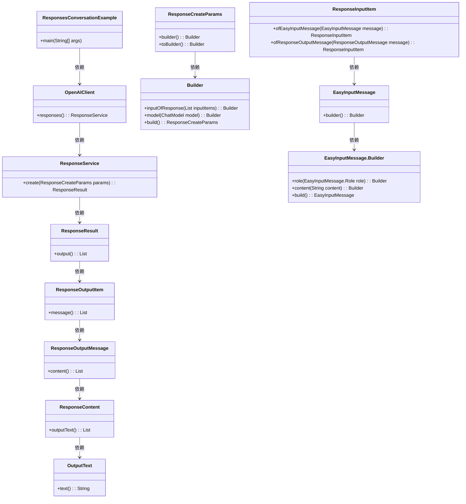
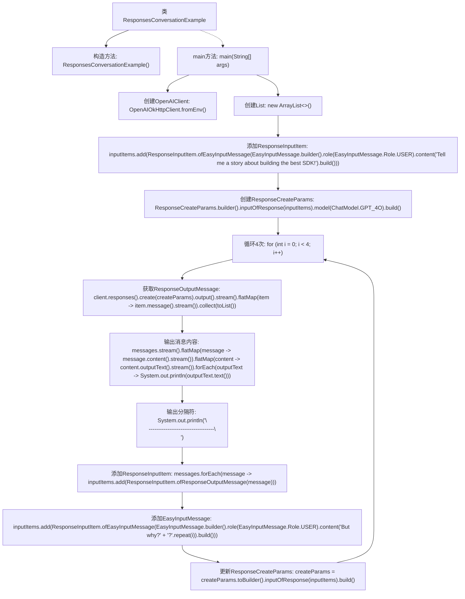

# 基础信息

|      |      |
|------|------|
| 名称 | ResponsesConversationExample |
| 编码语言 | .java |
| 代码路径 | openai-java/openai-java-example/src/main/java/com/openai/example/ResponsesConversationExample.java |
| 包名 | com.openai.example |
| 依赖项 | ['com.openai.client.OpenAIClient', 'com.openai.client.okhttp.OpenAIOkHttpClient', 'com.openai.models.ChatModel', 'com.openai.models.responses.EasyInputMessage', 'com.openai.models.responses.ResponseCreateParams', 'com.openai.models.responses.ResponseInputItem', 'com.openai.models.responses.ResponseOutputMessage', 'java.util.ArrayList', 'java.util.List', 'java.util.stream.Collectors.toList'] |
| 概述说明 | Java代码示例：利用OpenAI客户端生成对话响应并进行循环迭代。 |

# 说明

该Java示例代码展示了如何使用OpenAI客户端生成对话响应，并通过循环迭代实现连续对话。代码首先初始化OpenAI客户端，设置必要的参数，如API密钥和模型类型。然后，通过循环结构不断接收用户输入，调用OpenAI的API生成响应，并将响应输出给用户。这一过程可以持续进行，直到用户主动终止对话。整个流程展示了如何将OpenAI的对话生成能力集成到Java应用程序中，实现智能对话功能。

# 类列表 Class Summary

| 名称   | 类型  | 说明 |
|-------|------|-------------|
| ResponsesConversationExample | class | Java示例代码，使用OpenAI客户端生成对话响应并循环迭代。 |

## 类 ResponsesConversationExample

|      |      |
|------|------|
| 访问范围 | public final |
| 类型 | class |
| 名称 | ResponsesConversationExample |
| 说明 | Java示例代码，使用OpenAI客户端生成对话响应并循环迭代。 |

### UML类图

这段代码展示了一个与OpenAI API进行对话的示例。`ResponsesConversationExample`类通过`OpenAIClient`与API交互，生成对话内容并输出。代码通过构建`ResponseCreateParams`对象来配置请求参数，并通过循环不断更新对话内容。类图清晰地展示了各个类之间的依赖关系，以及如何通过构建器模式创建和更新请求参数。

### 内部方法调用关系图

这段代码展示了一个对话生成的过程，通过循环4次，每次生成对话内容并输出，然后将生成的对话内容添加到输入列表中，以便在下一次循环中使用。代码通过OpenAI客户端生成对话，并在每次循环后更新对话参数，以模拟多轮对话的场景。

### 字段列表 Field List

| 名称  | 类型  | 说明 |
|-------|-------|------|

### 方法列表 Method List

| 名称  | 类型  | 说明 |
|-------|-------|------|
| main | void | Java代码通过环境变量配置OpenAI客户端，使用GPT-4模型生成并输出对话响应。 |

