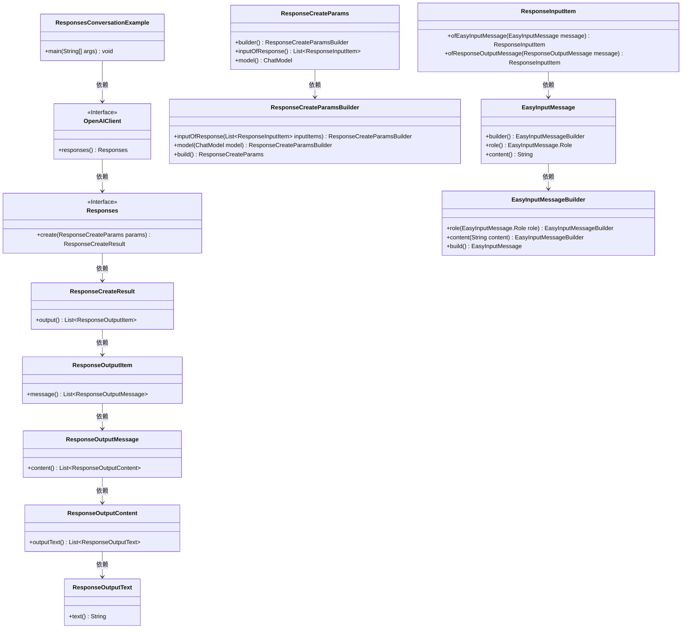
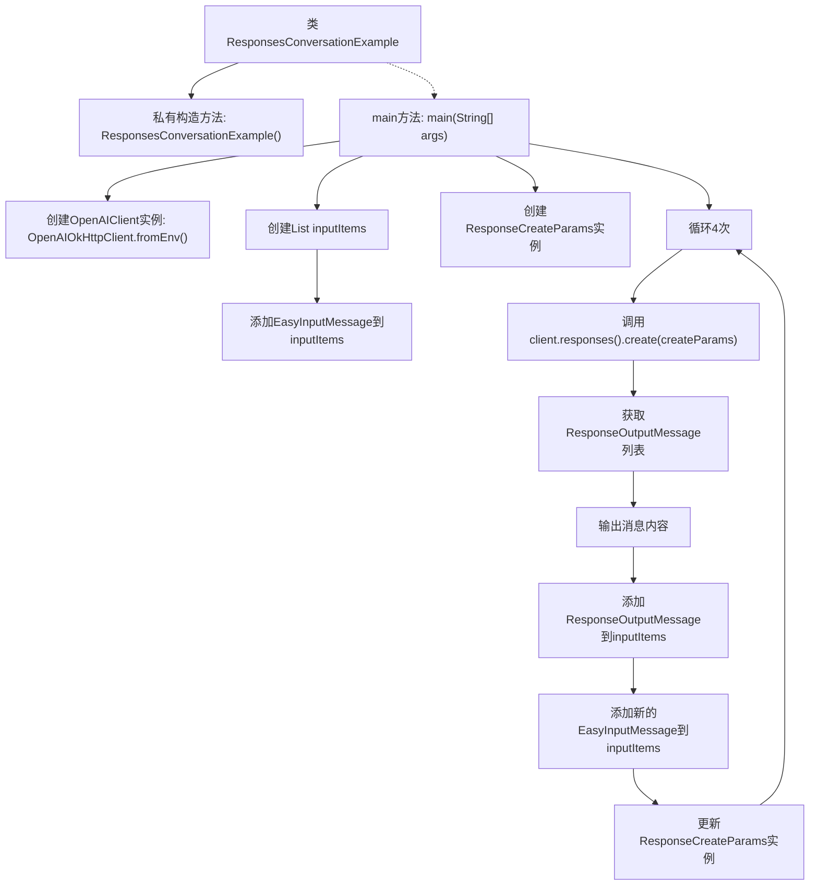

# 基础信息

|      |      |
|------|------|
| 名称 | ResponsesConversationExample |
| 编码语言 | .java |
| 代码路径 | openai-java/openai-java-example/src/main/java/com/openai/example/ResponsesConversationExample.java |
| 包名 | com.openai.example |
| 依赖项 | ['com.openai.client.OpenAIClient', 'com.openai.client.okhttp.OpenAIOkHttpClient', 'com.openai.models.ChatModel', 'com.openai.models.responses.EasyInputMessage', 'com.openai.models.responses.ResponseCreateParams', 'com.openai.models.responses.ResponseInputItem', 'com.openai.models.responses.ResponseOutputMessage', 'java.util.ArrayList', 'java.util.List', 'java.util.stream.Collectors.toList'] |
| 概述说明 | Java示例：四次循环生成对话，输出并追加用户问题。 |

# 说明

该示例展示了如何使用Java编程语言与OpenAI客户端进行交互，生成对话内容。具体实现中，程序通过循环执行四次，每次生成对话后输出结果，并将用户提出的问题追加到对话中。整个过程旨在模拟连续对话的场景，确保每次生成的对话内容能够基于前一次的对话上下文进行更新和扩展。

# 类列表 Class Summary

| 名称   | 类型  | 说明 |
|-------|------|-------------|
| ResponsesConversationExample | class | Java示例：使用OpenAI客户端生成对话，循环四次，每次输出并追加用户问题。 |

## 类 ResponsesConversationExample

|      |      |
|------|------|
| 访问范围 | public final |
| 类型 | class |
| 名称 | ResponsesConversationExample |
| 说明 | Java示例：使用OpenAI客户端生成对话，循环四次，每次输出并追加用户问题。 |

### UML类图

```mermaid
classDiagram
    class ResponsesConversationExample {
        +main(String[] args) void
    }

    class OpenAIClient {
        <<Interface>>
        +responses() Responses
    }

    class Responses {
        <<Interface>>
        +create(ResponseCreateParams params) ResponseCreateResult
    }

    class ResponseCreateResult {
        +output() List~ResponseOutputItem~
    }

    class ResponseOutputItem {
        +message() List~ResponseOutputMessage~
    }

    class ResponseOutputMessage {
        +content() List~ResponseOutputContent~
    }

    class ResponseOutputContent {
        +outputText() List~ResponseOutputText~
    }

    class ResponseOutputText {
        +text() String
    }

    class ResponseCreateParams {
        +builder() ResponseCreateParamsBuilder
        +inputOfResponse() List~ResponseInputItem~
        +model() ChatModel
    }

    class ResponseCreateParamsBuilder {
        +inputOfResponse(List~ResponseInputItem~ inputItems) ResponseCreateParamsBuilder
        +model(ChatModel model) ResponseCreateParamsBuilder
        +build() ResponseCreateParams
    }

    class ResponseInputItem {
        +ofEasyInputMessage(EasyInputMessage message) ResponseInputItem
        +ofResponseOutputMessage(ResponseOutputMessage message) ResponseInputItem
    }

    class EasyInputMessage {
        +builder() EasyInputMessageBuilder
        +role() EasyInputMessage.Role
        +content() String
    }

    class EasyInputMessageBuilder {
        +role(EasyInputMessage.Role role) EasyInputMessageBuilder
        +content(String content) EasyInputMessageBuilder
        +build() EasyInputMessage
    }

    ResponsesConversationExample --> OpenAIClient : 依赖
    OpenAIClient --> Responses : 依赖
    Responses --> ResponseCreateResult : 依赖
    ResponseCreateResult --> ResponseOutputItem : 依赖
    ResponseOutputItem --> ResponseOutputMessage : 依赖
    ResponseOutputMessage --> ResponseOutputContent : 依赖
    ResponseOutputContent --> ResponseOutputText : 依赖
    ResponseCreateParams --> ResponseCreateParamsBuilder : 依赖
    ResponseInputItem --> EasyInputMessage : 依赖
    EasyInputMessage --> EasyInputMessageBuilder : 依赖
```

这段代码展示了一个与OpenAI API进行对话的示例。`ResponsesConversationExample`类通过`OpenAIClient`与API交互，构建并发送对话请求，处理返回的响应消息，并将这些消息重新添加到输入中，以便进行多轮对话。代码中使用了多个构建器模式来创建复杂的请求参数和消息对象，并通过流式处理来解析和输出API的响应内容。

### 内部方法调用关系图

```mermaid
graph TD
    A["类ResponsesConversationExample"]
    B["私有构造方法: ResponsesConversationExample()"]
    C["main方法: main(String[] args)"]
    D["创建OpenAIClient实例: OpenAIOkHttpClient.fromEnv()"]
    E["创建List<ResponseInputItem> inputItems"]
    F["添加EasyInputMessage到inputItems"]
    G["创建ResponseCreateParams实例"]
    H["循环4次"]
    I["调用client.responses().create(createParams)"]
    J["获取ResponseOutputMessage列表"]
    K["输出消息内容"]
    L["添加ResponseOutputMessage到inputItems"]
    M["添加新的EasyInputMessage到inputItems"]
    N["更新ResponseCreateParams实例"]

    A --> B
    A -.-> C
    C --> D
    C --> E
    E --> F
    C --> G
    C --> H
    H --> I
    I --> J
    J --> K
    K --> L
    L --> M
    M --> N
    N --> H
```

这段代码展示了如何使用OpenAI客户端进行多轮对话。首先，代码通过环境变量配置OpenAI客户端，然后创建并初始化输入消息列表。接着，代码进入一个循环，在每次循环中，客户端生成响应消息，输出消息内容，并将响应消息和新的用户输入添加到输入列表中，更新请求参数。循环执行四次，模拟了多轮对话的过程。

### 字段列表 Field List

| 名称  | 类型  | 说明 |
|-------|-------|------|

### 方法列表 Method List

| 名称  | 类型  | 说明 |
|-------|-------|------|
| main | void | Java代码通过OpenAI客户端生成对话，循环四次，每次添加用户提问并输出响应。 |

