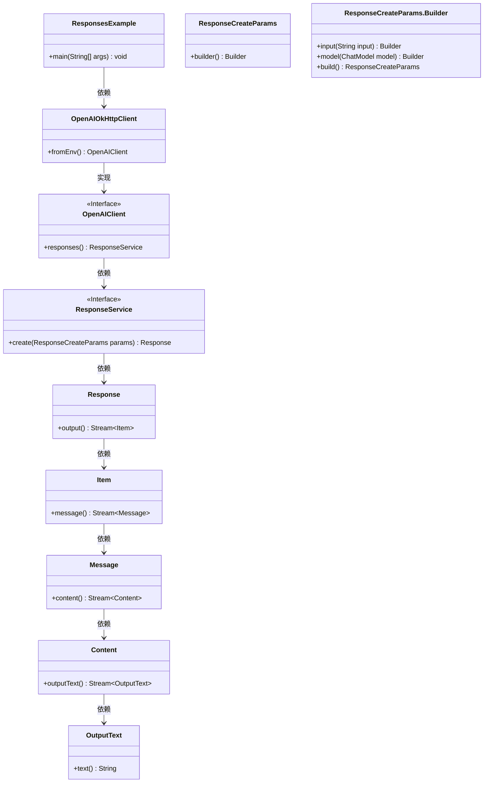
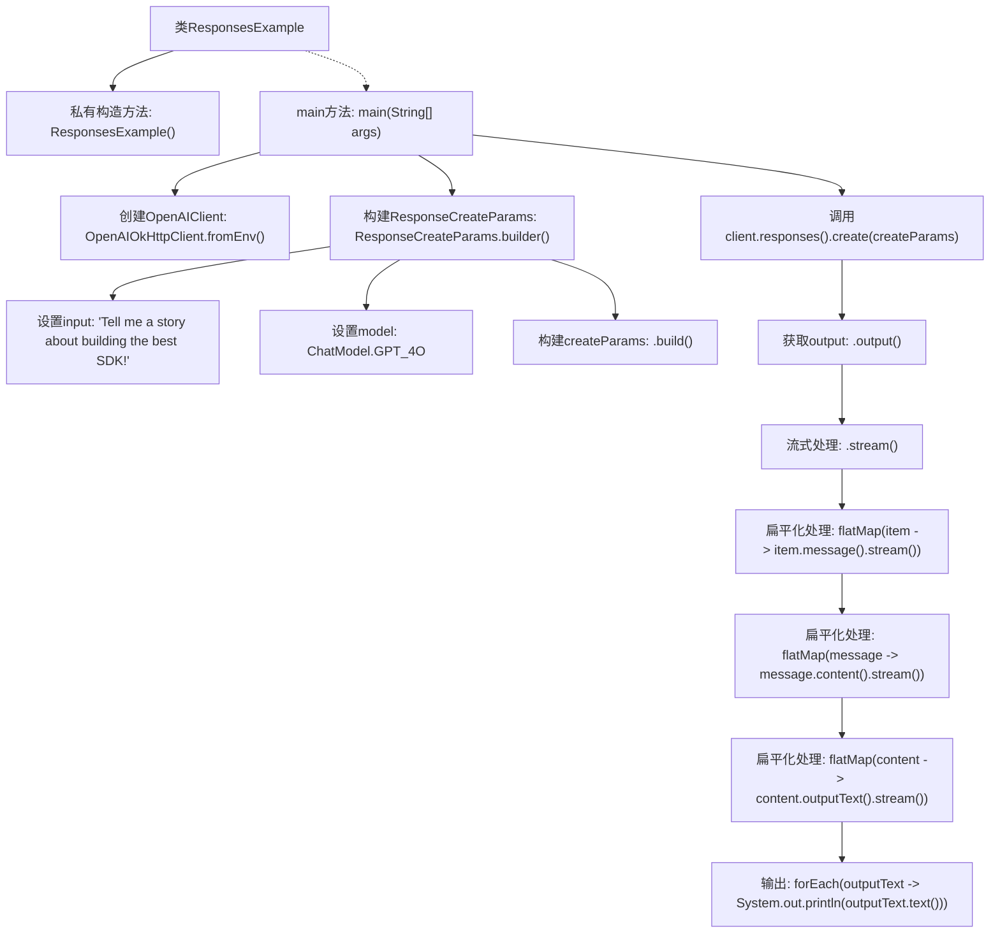

# 基础信息

|      |      |
|------|------|
| 名称 | ResponsesExample |
| 编码语言 | .java |
| 代码路径 | openai-java/openai-java-example/src/main/java/com/openai/example/ResponsesExample.java |
| 包名 | com.openai.example |
| 依赖项 | ['com.openai.client.OpenAIClient', 'com.openai.client.okhttp.OpenAIOkHttpClient', 'com.openai.models.ChatModel', 'com.openai.models.responses.ResponseCreateParams'] |
| 概述说明 | Java代码通过环境变量配置OpenAI客户端，生成故事并输出结果。 |

# 说明

该Java示例代码展示了如何通过环境变量配置OpenAI客户端，并利用该客户端请求生成故事。代码首先从系统环境变量中获取必要的配置信息，如API密钥等，然后初始化OpenAI客户端。接着，代码通过客户端向OpenAI发送请求，要求生成一个故事，并最终将生成的故事结果输出。整个过程展示了如何通过环境变量进行灵活配置，并利用OpenAI的API进行文本生成。

# 类列表 Class Summary

| 名称   | 类型  | 说明 |
|-------|------|-------------|
| ResponsesExample | class | Java示例代码，通过环境变量配置OpenAI客户端，请求生成故事并输出结果。 |

## 类 ResponsesExample

|      |      |
|------|------|
| 访问范围 | public final |
| 类型 | class |
| 名称 | ResponsesExample |
| 说明 | Java示例代码，通过环境变量配置OpenAI客户端，请求生成故事并输出结果。 |

### UML类图

这段代码展示了一个使用OpenAI API的示例程序。`ResponsesExample`类通过`OpenAIOkHttpClient`从环境变量中获取配置，并创建一个`OpenAIClient`实例。然后，它使用`ResponseCreateParams`构建请求参数，并通过`OpenAIClient`的`responses()`方法发送请求。最终，程序处理并输出响应的文本内容。类图清晰地展示了各个类之间的依赖关系和接口实现。

### 内部方法调用关系图

这段代码展示了如何使用OpenAI客户端创建和发送请求，并处理返回的响应。代码首先通过环境变量配置OpenAI客户端，然后构建请求参数，包括输入文本和模型类型。接着，发送请求并获取响应，通过流式处理和扁平化操作提取并输出响应中的文本内容。整个流程清晰地展示了从配置客户端到输出响应文本的完整过程。

### 字段列表 Field List

| 名称  | 类型  | 说明 |
|-------|-------|------|

### 方法列表 Method List

| 名称  | 类型  | 说明 |
|-------|-------|------|
| main | void | Java代码配置OpenAI客户端，调用GPT-4模型生成故事并输出。 |

