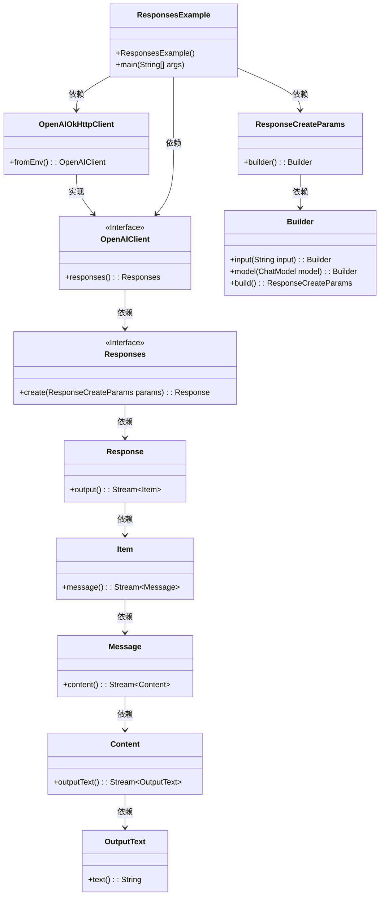
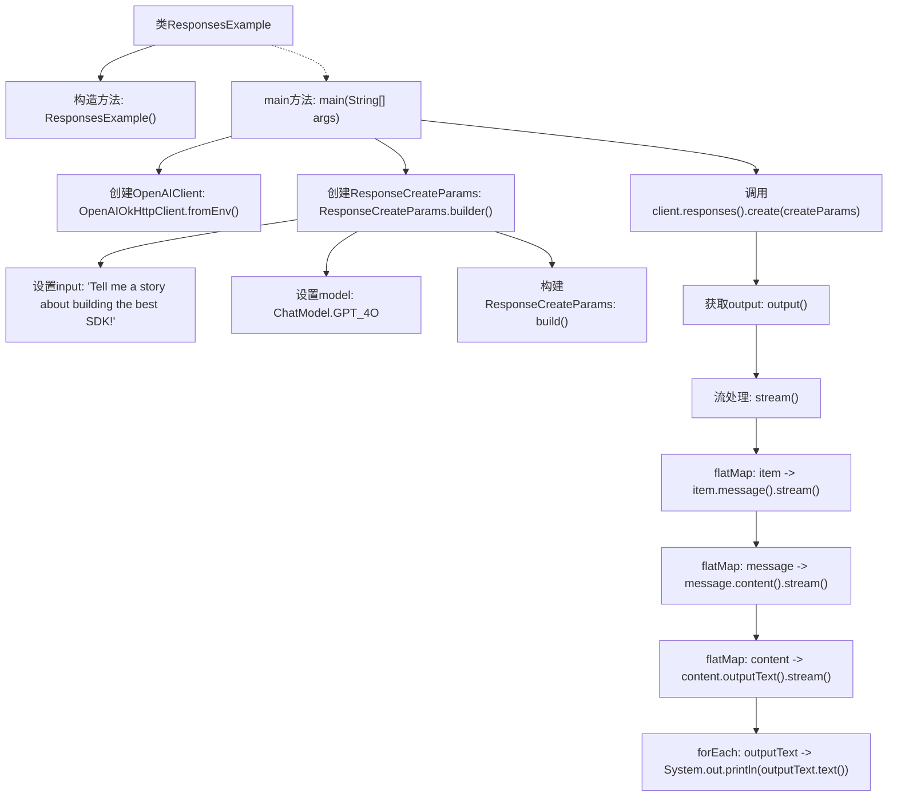

# 基础信息

|      |      |
|------|------|
| 名称 | ResponsesExample |
| 编码语言 | .java |
| 代码路径 | openai-java/openai-java-example/src/main/java/com/openai/example/ResponsesExample.java |
| 包名 | com.openai.example |
| 依赖项 | ['com.openai.client.OpenAIClient', 'com.openai.client.okhttp.OpenAIOkHttpClient', 'com.openai.models.ChatModel', 'com.openai.models.responses.ResponseCreateParams'] |
| 概述说明 | Java代码通过环境变量配置OpenAI客户端，使用GPT-4生成故事并输出。 |

# 说明

该示例展示了如何在Java中通过环境变量配置OpenAI客户端，并利用GPT-4模型生成故事内容。首先，程序从环境变量中读取必要的配置信息，如API密钥等，以初始化OpenAI客户端。接着，调用GPT-4模型生成一段故事文本。最后，程序将生成的故事内容输出到控制台或指定的输出流中。整个过程展示了如何通过环境变量灵活配置客户端，并利用先进的AI模型进行文本生成。

# 类列表 Class Summary

| 名称   | 类型  | 说明 |
|-------|------|-------------|
| ResponsesExample | class | Java代码示例：通过环境变量配置OpenAI客户端，使用GPT-4模型生成故事并输出。 |

## 类 ResponsesExample

|      |      |
|------|------|
| 访问范围 | public final |
| 类型 | class |
| 名称 | ResponsesExample |
| 说明 | Java代码示例：通过环境变量配置OpenAI客户端，使用GPT-4模型生成故事并输出。 |

### UML类图

```mermaid
classDiagram
    class ResponsesExample {
        +ResponsesExample()
        +main(String[] args)
    }

    class OpenAIClient {
        <<Interface>>
        +responses() : Responses
    }

    class OpenAIOkHttpClient {
        +fromEnv() : OpenAIClient
    }

    class ResponseCreateParams {
        +builder() : Builder
    }

    class Builder {
        +input(String input) : Builder
        +model(ChatModel model) : Builder
        +build() : ResponseCreateParams
    }

    class Responses {
        <<Interface>>
        +create(ResponseCreateParams params) : Response
    }

    class Response {
        +output() : Stream~Item~
    }

    class Item {
        +message() : Stream~Message~
    }

    class Message {
        +content() : Stream~Content~
    }

    class Content {
        +outputText() : Stream~OutputText~
    }

    class OutputText {
        +text() : String
    }

    ResponsesExample --> OpenAIOkHttpClient : 依赖
    OpenAIOkHttpClient --> OpenAIClient : 实现
    ResponsesExample --> ResponseCreateParams : 依赖
    ResponseCreateParams --> Builder : 依赖
    ResponsesExample --> OpenAIClient : 依赖
    OpenAIClient --> Responses : 依赖
    Responses --> Response : 依赖
    Response --> Item : 依赖
    Item --> Message : 依赖
    Message --> Content : 依赖
    Content --> OutputText : 依赖
```

**描述**：该代码展示了一个使用OpenAI客户端生成响应的示例。`ResponsesExample`类通过`OpenAIOkHttpClient`获取客户端实例，并构建请求参数`ResponseCreateParams`。客户端调用`responses().create()`方法生成响应，并通过流式处理逐层提取最终输出文本。类图清晰地展示了各个类之间的依赖关系，特别是`OpenAIClient`与`Responses`接口的实现关系，以及从`Response`到`OutputText`的逐层流式处理过程。

### 内部方法调用关系图

```mermaid
graph TD
    A["类ResponsesExample"]
    B["构造方法: ResponsesExample()"]
    C["main方法: main(String[] args)"]
    D["创建OpenAIClient: OpenAIOkHttpClient.fromEnv()"]
    E["创建ResponseCreateParams: ResponseCreateParams.builder()"]
    F["设置input: 'Tell me a story about building the best SDK!'"]
    G["设置model: ChatModel.GPT_4O"]
    H["构建ResponseCreateParams: build()"]
    I["调用client.responses().create(createParams)"]
    J["获取output: output()"]
    K["流处理: stream()"]
    L["flatMap: item -> item.message().stream()"]
    M["flatMap: message -> message.content().stream()"]
    N["flatMap: content -> content.outputText().stream()"]
    O["forEach: outputText -> System.out.println(outputText.text())"]

    A --> B
    A -.-> C
    C --> D
    C --> E
    E --> F
    E --> G
    E --> H
    C --> I
    I --> J
    J --> K
    K --> L
    L --> M
    M --> N
    N --> O
```

这段代码定义了一个名为`ResponsesExample`的类，其中包含一个私有的构造方法和一个`main`方法。`main`方法首先通过环境变量配置`OpenAIClient`，然后构建一个`ResponseCreateParams`对象，包含输入文本和模型类型。接着，通过客户端发送请求并处理返回的响应，最终将处理后的文本输出到控制台。

### 字段列表 Field List

| 名称  | 类型  | 说明 |
|-------|-------|------|

### 方法列表 Method List

| 名称  | 类型  | 说明 |
|-------|-------|------|
| main | void | Java代码通过环境变量配置OpenAI客户端，调用GPT-4模型生成故事并输出。 |

