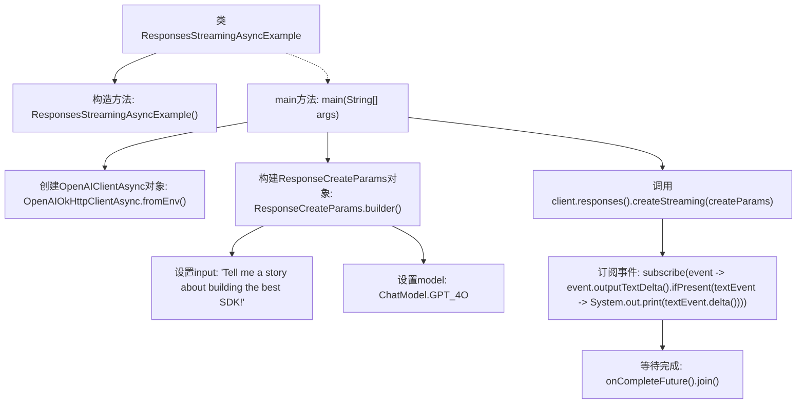

# 基础信息

|      |      |
|------|------|
| 名称 | ResponsesStreamingAsyncExample |
| 编码语言 | .java |
| 代码路径 | openai-java/openai-java-example/src/main/java/com/openai/example/ResponsesStreamingAsyncExample.java |
| 包名 | com.openai.example |
| 依赖项 | ['com.openai.client.OpenAIClientAsync', 'com.openai.client.okhttp.OpenAIOkHttpClientAsync', 'com.openai.models.ChatModel', 'com.openai.models.responses.ResponseCreateParams'] |
| 概述说明 | Java代码示例：异步流式生成GPT-4故事。 |

# 说明

该内容描述了在Java中使用OpenAI客户端进行异步流式生成GPT-4故事的过程。通过异步流式处理，能够高效地生成故事内容，并实时获取生成的文本片段。这种方法适用于需要持续输出或处理大量文本的场景，能够提升用户体验和系统性能。

# 类列表 Class Summary

| 名称   | 类型  | 说明 |
|-------|------|-------------|
| ResponsesStreamingAsyncExample | class | Java示例代码：使用OpenAI客户端异步流式生成GPT-4故事。 |


## 类 ResponsesStreamingAsyncExample

|      |      |
|------|------|
| 访问范围 | public final |
| 类型 | class |
| 名称 | ResponsesStreamingAsyncExample |
| 说明 | Java示例代码：使用OpenAI客户端异步流式生成GPT-4故事。 |


### UML类图

```mermaid
classDiagram
    class ResponsesStreamingAsyncExample {
        -ResponsesStreamingAsyncExample()
        +main(String[] args)
    }

    class OpenAIClientAsync {
        <<Interface>>
    }

    class OpenAIOkHttpClientAsync {
        +fromEnv() OpenAIClientAsync
    }

    class ResponseCreateParams {
        +builder() Builder
    }

    class ResponseCreateParams$Builder {
        +input(String input) Builder
        +model(ChatModel model) Builder
        +build() ResponseCreateParams
    }

    class ChatModel {
        +GPT_4O ChatModel
    }

    ResponsesStreamingAsyncExample --> OpenAIOkHttpClientAsync : 依赖
    ResponsesStreamingAsyncExample --> ResponseCreateParams : 依赖
    ResponsesStreamingAsyncExample --> OpenAIClientAsync : 依赖
    OpenAIOkHttpClientAsync ..|> OpenAIClientAsync : 实现
    ResponseCreateParams --> ResponseCreateParams$Builder : 依赖
```

这段代码展示了一个异步流式响应的示例，主要涉及`ResponsesStreamingAsyncExample`类，该类通过`OpenAIOkHttpClientAsync`从环境变量中配置客户端，并使用`ResponseCreateParams`构建请求参数。`OpenAIClientAsync`是一个接口，`OpenAIOkHttpClientAsync`是其实现类。代码通过流式方式处理响应，并输出文本增量。


### 内部方法调用关系图



这段代码定义了一个名为 `ResponsesStreamingAsyncExample` 的类，其中包含一个私有的构造方法和一个 `main` 方法。`main` 方法首先通过环境变量配置 `OpenAIClientAsync` 客户端，然后构建一个包含输入文本和模型的 `ResponseCreateParams` 对象。接着，代码调用客户端的 `createStreaming` 方法，订阅流式响应事件，并在控制台输出文本增量。最后，代码等待所有操作完成。

### 字段列表 Field List

| 名称  | 类型  | 说明 |
|-------|-------|------|

### 方法列表 Method List

| 名称  | 类型  | 说明 |
|-------|-------|------|
| main | void | Java代码配置OpenAI客户端，通过环境变量设置API密钥，使用GPT-4模型生成并流式输出故事。 |


