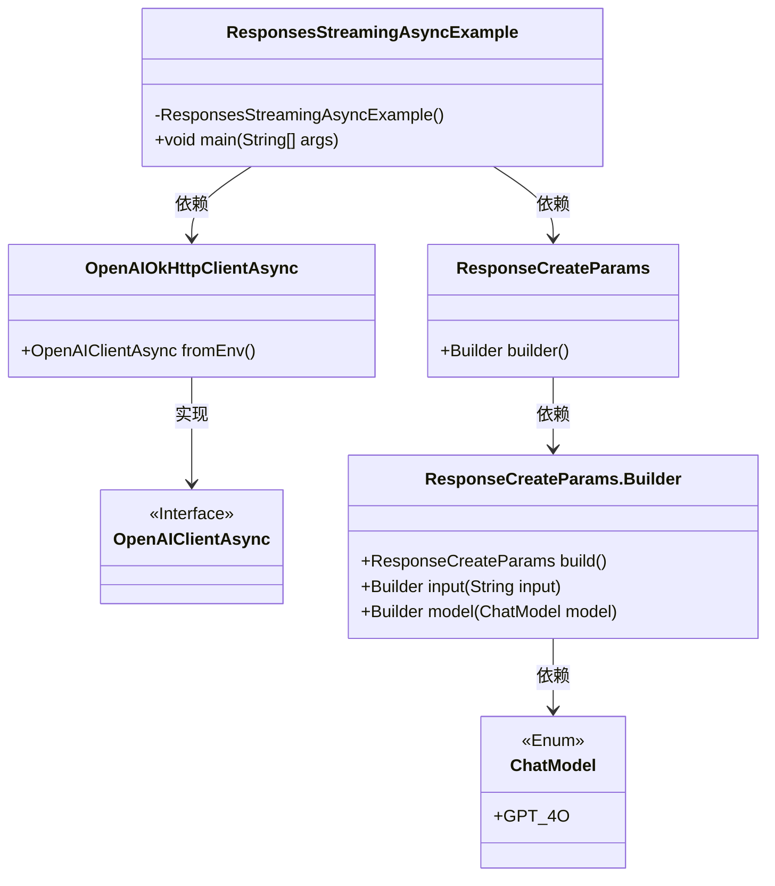
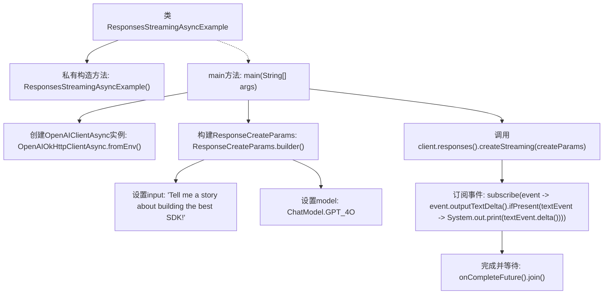

# 基础信息

|      |      |
|------|------|
| 名称 | ResponsesStreamingAsyncExample |
| 编码语言 | .java |
| 代码路径 | openai-java/openai-java-example/src/main/java/com/openai/example/ResponsesStreamingAsyncExample.java |
| 包名 | com.openai.example |
| 依赖项 | ['com.openai.client.OpenAIClientAsync', 'com.openai.client.okhttp.OpenAIOkHttpClientAsync', 'com.openai.models.ChatModel', 'com.openai.models.responses.ResponseCreateParams'] |
| 概述说明 | 配置环境变量调用OpenAI API，使用GPT-4模型生成异步流式故事。 |

# 说明

该示例展示了如何配置环境变量以调用OpenAI API，并使用GPT-4模型生成故事。通过异步流式响应，系统能够实时处理并输出生成的故事内容。此方法适用于需要高效、实时生成文本的场景，如聊天机器人、内容创作工具等。配置环境变量确保API调用的安全性和灵活性，而GPT-4模型则提供了高质量的文本生成能力。

# 类列表 Class Summary

| 名称   | 类型  | 说明 |
|-------|------|-------------|
| ResponsesStreamingAsyncExample | class | 异步流式响应示例，配置环境变量调用OpenAI API，使用GPT-4模型生成故事。 |

## 类 ResponsesStreamingAsyncExample

|      |      |
|------|------|
| 访问范围 | public final |
| 类型 | class |
| 名称 | ResponsesStreamingAsyncExample |
| 说明 | 异步流式响应示例，配置环境变量调用OpenAI API，使用GPT-4模型生成故事。 |

### UML类图

```mermaid
classDiagram
    class ResponsesStreamingAsyncExample {
        -ResponsesStreamingAsyncExample()
        +void main(String[] args)
    }

    class OpenAIClientAsync {
        <<Interface>>
    }

    class OpenAIOkHttpClientAsync {
        +OpenAIClientAsync fromEnv()
    }

    class ResponseCreateParams {
        +Builder builder()
    }

    class ResponseCreateParams.Builder {
        +ResponseCreateParams build()
        +Builder input(String input)
        +Builder model(ChatModel model)
    }

    class ChatModel {
        <<Enum>>
        +GPT_4O
    }

    ResponsesStreamingAsyncExample --> OpenAIOkHttpClientAsync : 依赖
    ResponsesStreamingAsyncExample --> ResponseCreateParams : 依赖
    OpenAIOkHttpClientAsync --> OpenAIClientAsync : 实现
    ResponseCreateParams --> ResponseCreateParams.Builder : 依赖
    ResponseCreateParams.Builder --> ChatModel : 依赖
```

**描述：**  
`ResponsesStreamingAsyncExample` 是一个最终类，包含一个私有的构造函数和一个静态的 `main` 方法。`main` 方法通过环境变量配置 `OpenAIClientAsync` 客户端，并使用 `ResponseCreateParams` 构建请求参数。`OpenAIOkHttpClientAsync` 实现了 `OpenAIClientAsync` 接口，`ResponseCreateParams` 使用其内部构建器 `Builder` 来设置请求的输入和模型。`ChatModel` 是一个枚举类，表示可用的模型类型。

### 内部方法调用关系图

```mermaid
graph TD
    A["类ResponsesStreamingAsyncExample"]
    B["私有构造方法: ResponsesStreamingAsyncExample()"]
    C["main方法: main(String[] args)"]
    D["创建OpenAIClientAsync实例: OpenAIOkHttpClientAsync.fromEnv()"]
    E["构建ResponseCreateParams: ResponseCreateParams.builder()"]
    F["设置input: 'Tell me a story about building the best SDK!'"]
    G["设置model: ChatModel.GPT_4O"]
    H["调用client.responses().createStreaming(createParams)"]
    I["订阅事件: subscribe(event -> event.outputTextDelta().ifPresent(textEvent -> System.out.print(textEvent.delta())))"]
    J["完成并等待: onCompleteFuture().join()"]

    A --> B
    A -.-> C
    C --> D
    C --> E
    E --> F
    E --> G
    C --> H
    H --> I
    I --> J
```

这段代码是一个异步流式响应的示例，用于与OpenAI API进行交互。首先，它通过环境变量配置OpenAIClientAsync实例，然后构建一个包含输入和模型的请求参数。接着，它调用API的流式响应方法，并订阅事件以实时输出文本增量。最后，等待所有操作完成。

### 字段列表 Field List

| 名称  | 类型  | 说明 |
|-------|-------|------|

### 方法列表 Method List

| 名称  | 类型  | 说明 |
|-------|-------|------|
| main | void | Java代码通过环境变量配置OpenAI客户端，使用GPT-4模型生成并流式输出故事。 |

