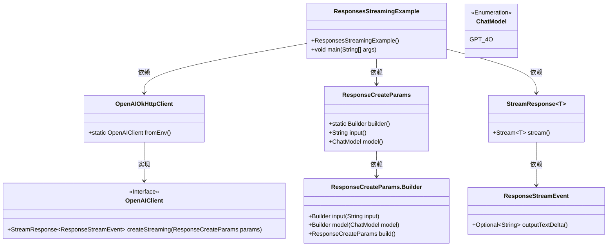
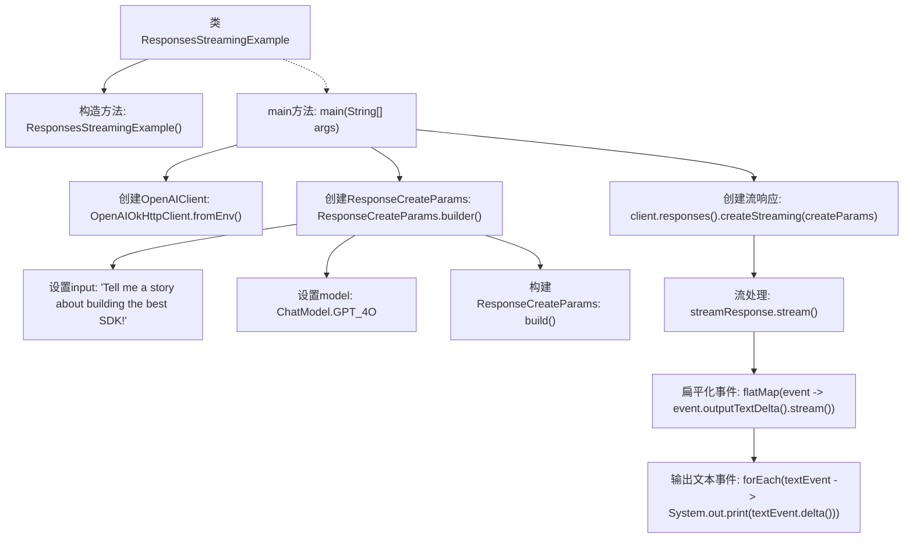

# 基础信息

|      |      |
|------|------|
| 名称 | ResponsesStreamingExample |
| 编码语言 | .java |
| 代码路径 | openai-java/openai-java-example/src/main/java/com/openai/example/ResponsesStreamingExample.java |
| 包名 | com.openai.example |
| 依赖项 | ['com.openai.client.OpenAIClient', 'com.openai.client.okhttp.OpenAIOkHttpClient', 'com.openai.core.http.StreamResponse', 'com.openai.models.ChatModel', 'com.openai.models.responses.ResponseCreateParams', 'com.openai.models.responses.ResponseStreamEvent'] |
| 概述说明 | Java代码通过OpenAI API流式生成响应并输出文本。 |

# 说明

该内容描述了一个Java示例代码，该代码利用OpenAI API以流式方式生成响应并输出文本。流式生成意味着数据可以逐步处理和显示，而不是等待整个响应完成后再输出。这种方法适用于需要实时或逐步展示结果的场景，提高了用户体验和系统效率。OpenAI API的使用表明该代码依赖于先进的自然语言处理技术，能够生成高质量的文本响应。Java作为编程语言，确保了代码的跨平台兼容性和稳定性。

# 类列表 Class Summary

| 名称   | 类型  | 说明 |
|-------|------|-------------|
| ResponsesStreamingExample | class | Java示例代码使用OpenAI API流式生成响应并输出文本。 |

## 类 ResponsesStreamingExample

|      |      |
|------|------|
| 访问范围 | public final |
| 类型 | class |
| 名称 | ResponsesStreamingExample |
| 说明 | Java示例代码使用OpenAI API流式生成响应并输出文本。 |

### UML类图

这段代码展示了如何使用OpenAI客户端进行流式响应的处理。`ResponsesStreamingExample`类通过`OpenAIOkHttpClient`获取OpenAI客户端实例，并构建`ResponseCreateParams`参数对象，调用`createStreaming`方法获取流式响应。流式响应事件通过`ResponseStreamEvent`处理，输出文本增量。整个过程涉及多个类的协作，包括参数构建、流式响应处理等。

### 内部方法调用关系图

这段代码展示了如何使用OpenAI客户端创建一个流式响应，并处理流中的事件。代码首先配置了OpenAI客户端，然后构建了一个包含输入和模型的请求参数对象。接着，通过客户端创建一个流式响应，并处理流中的事件，最终输出文本事件的增量内容。整个过程展示了如何有效地处理流式数据，并实时输出结果。

### 字段列表 Field List

| 名称  | 类型  | 说明 |
|-------|-------|------|

### 方法列表 Method List

| 名称  | 类型  | 说明 |
|-------|-------|------|
| main | void | Java代码通过环境变量配置OpenAI客户端，使用GPT-4模型生成并流式输出故事。 |

