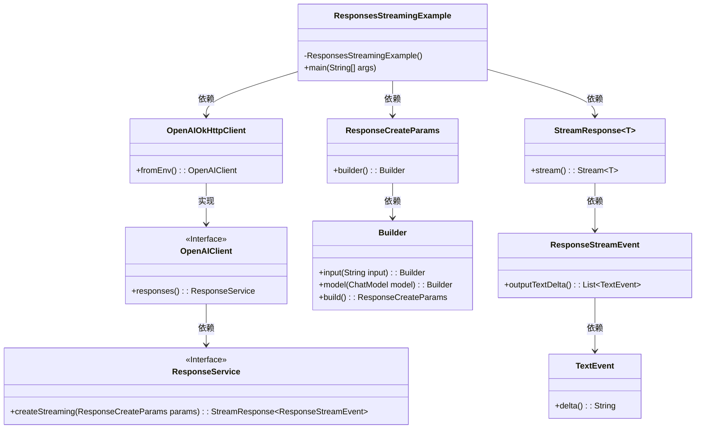
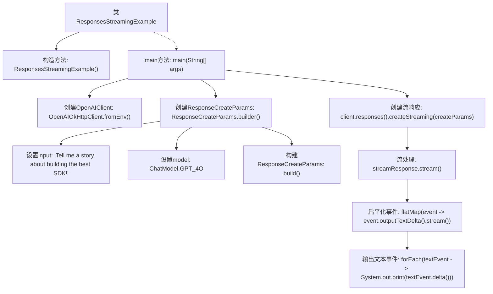

# 基础信息

|      |      |
|------|------|
| 名称 | ResponsesStreamingExample |
| 编码语言 | .java |
| 代码路径 | openai-java/openai-java-example/src/main/java/com/openai/example/ResponsesStreamingExample.java |
| 包名 | com.openai.example |
| 依赖项 | ['com.openai.client.OpenAIClient', 'com.openai.client.okhttp.OpenAIOkHttpClient', 'com.openai.core.http.StreamResponse', 'com.openai.models.ChatModel', 'com.openai.models.responses.ResponseCreateParams', 'com.openai.models.responses.ResponseStreamEvent'] |
| 概述说明 | Java代码通过OpenAI API流式生成GPT-4响应并输出结果。 |

# 说明

该内容描述了一个使用Java编写的示例代码，该代码通过调用OpenAI API以流式方式生成GPT-4的响应，并将生成的结果输出。此示例展示了如何集成OpenAI的GPT-4模型到Java应用程序中，利用API的流式处理功能逐步获取并显示生成的文本内容。

# 类列表 Class Summary

| 名称   | 类型  | 说明 |
|-------|------|-------------|
| ResponsesStreamingExample | class | Java示例代码使用OpenAI API流式生成GPT-4响应并输出。 |

## 类 ResponsesStreamingExample

|      |      |
|------|------|
| 访问范围 | public final |
| 类型 | class |
| 名称 | ResponsesStreamingExample |
| 说明 | Java示例代码使用OpenAI API流式生成GPT-4响应并输出。 |

### UML类图

```mermaid
classDiagram
    class ResponsesStreamingExample {
        -ResponsesStreamingExample()
        +main(String[] args)
    }

    class OpenAIClient {
        <<Interface>>
        +responses() : ResponseService
    }

    class OpenAIOkHttpClient {
        +fromEnv() : OpenAIClient
    }

    class ResponseService {
        <<Interface>>
        +createStreaming(ResponseCreateParams params) : StreamResponse~ResponseStreamEvent~
    }

    class ResponseCreateParams {
        +builder() : Builder
    }

    class Builder {
        +input(String input) : Builder
        +model(ChatModel model) : Builder
        +build() : ResponseCreateParams
    }

    class StreamResponse~T~ {
        +stream() : Stream~T~
    }

    class ResponseStreamEvent {
        +outputTextDelta() : List~TextEvent~
    }

    class TextEvent {
        +delta() : String
    }

    ResponsesStreamingExample --> OpenAIOkHttpClient : 依赖
    OpenAIOkHttpClient --> OpenAIClient : 实现
    ResponsesStreamingExample --> ResponseCreateParams : 依赖
    ResponsesStreamingExample --> StreamResponse~ResponseStreamEvent~ : 依赖
    StreamResponse~ResponseStreamEvent~ --> ResponseStreamEvent : 依赖
    ResponseStreamEvent --> TextEvent : 依赖
    OpenAIClient --> ResponseService : 依赖
    ResponseCreateParams --> Builder : 依赖
```

类图描述：  
`ResponsesStreamingExample` 类通过 `OpenAIOkHttpClient` 获取 `OpenAIClient` 实例，并使用 `ResponseCreateParams` 构建请求参数。`OpenAIClient` 依赖 `ResponseService` 接口来处理流式响应，`ResponseService` 返回 `StreamResponse` 对象，该对象包含 `ResponseStreamEvent` 事件流。`ResponseStreamEvent` 进一步解析为 `TextEvent`，最终输出文本增量。整个流程展示了从客户端配置到流式响应的完整调用链。

### 内部方法调用关系图

```mermaid
graph TD
    A["类ResponsesStreamingExample"]
    B["构造方法: ResponsesStreamingExample()"]
    C["main方法: main(String[] args)"]
    D["创建OpenAIClient: OpenAIOkHttpClient.fromEnv()"]
    E["创建ResponseCreateParams: ResponseCreateParams.builder()"]
    F["设置input: 'Tell me a story about building the best SDK!'"]
    G["设置model: ChatModel.GPT_4O"]
    H["构建ResponseCreateParams: build()"]
    I["创建流响应: client.responses().createStreaming(createParams)"]
    J["流处理: streamResponse.stream()"]
    K["扁平化事件: flatMap(event -> event.outputTextDelta().stream())"]
    L["输出文本事件: forEach(textEvent -> System.out.print(textEvent.delta()))"]

    A --> B
    A -.-> C
    C --> D
    C --> E
    E --> F
    E --> G
    E --> H
    C --> I
    I --> J
    J --> K
    K --> L
```

这段代码展示了如何使用OpenAI客户端创建流式响应，并处理流中的事件。首先，通过环境变量配置OpenAI客户端，然后构建请求参数并创建流式响应。接着，通过流处理事件，提取并输出文本增量。整个过程展示了流式API的高效使用，适合处理实时数据流。

### 字段列表 Field List

| 名称  | 类型  | 说明 |
|-------|-------|------|

### 方法列表 Method List

| 名称  | 类型  | 说明 |
|-------|-------|------|
| main | void | Java代码通过环境变量配置OpenAI客户端，使用GPT-4模型生成并流式输出故事。 |

