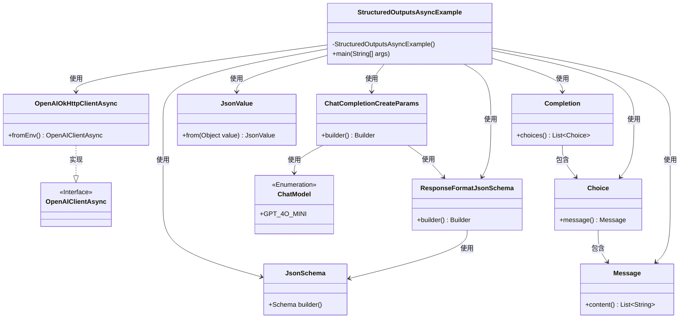
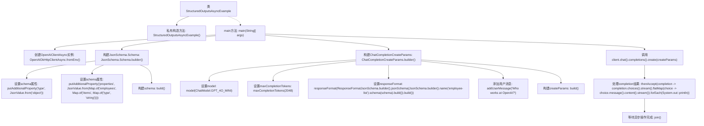

# 基础信息

|      |      |
|------|------|
| 名称 | StructuredOutputsAsyncExample |
| 编码语言 | .java |
| 代码路径 | openai-java/openai-java-example/src/main/java/com/openai/example/StructuredOutputsAsyncExample.java |
| 包名 | com.openai.example |
| 依赖项 | ['com.openai.client.OpenAIClientAsync', 'com.openai.client.okhttp.OpenAIOkHttpClientAsync', 'com.openai.core.JsonValue', 'com.openai.models.ChatModel', 'com.openai.models.ResponseFormatJsonSchema', 'com.openai.models.ResponseFormatJsonSchema.JsonSchema', 'com.openai.models.chat.completions.ChatCompletionCreateParams', 'java.util.Map'] |
| 概述说明 | Java示例：异步调用OpenAI客户端，配置JSON模式，查询员工信息并输出结果。 |

# 说明

该示例展示了如何使用Java编写代码，通过OpenAI客户端进行异步调用。首先，配置了JSON模式以确保请求和响应的数据结构一致。接着，代码发起查询请求，目标是从OpenAI获取员工信息。最后，程序将查询结果输出。整个过程展示了如何高效地集成第三方API并处理异步任务。

# 类列表 Class Summary

| 名称   | 类型  | 说明 |
|-------|------|-------------|
| StructuredOutputsAsyncExample | class | Java示例：使用OpenAI客户端异步调用，配置JSON模式，查询OpenAI员工信息并输出结果。 |

## 类 StructuredOutputsAsyncExample

|      |      |
|------|------|
| 访问范围 | public final |
| 类型 | class |
| 名称 | StructuredOutputsAsyncExample |
| 说明 | Java示例：使用OpenAI客户端异步调用，配置JSON模式，查询OpenAI员工信息并输出结果。 |

### UML类图

这段代码展示了一个异步生成结构化输出的示例。`StructuredOutputsAsyncExample`类通过`OpenAIOkHttpClientAsync`与OpenAI API进行交互，使用`JsonSchema`和`JsonValue`构建请求参数，并通过`ChatCompletionCreateParams`配置请求。最终，API返回的响应通过`Completion`、`Choice`和`Message`类进行处理，输出内容到控制台。

### 内部方法调用关系图

这段代码展示了一个异步调用OpenAI API的示例。首先，它通过环境变量配置了OpenAI客户端，然后构建了一个JSON schema用于定义API请求的响应格式。接着，它设置了聊天完成参数，包括模型、最大令牌数和响应格式，并添加了用户消息。最后，它异步调用API并处理返回的完成结果，将内容打印到控制台。

### 字段列表 Field List

| 名称  | 类型  | 说明 |
|-------|-------|------|

### 方法列表 Method List

| 名称  | 类型  | 说明 |
|-------|-------|------|
| main | void | Java代码通过环境变量配置OpenAI客户端，定义JSON模式并创建聊天完成参数，最后执行并输出结果。 |

