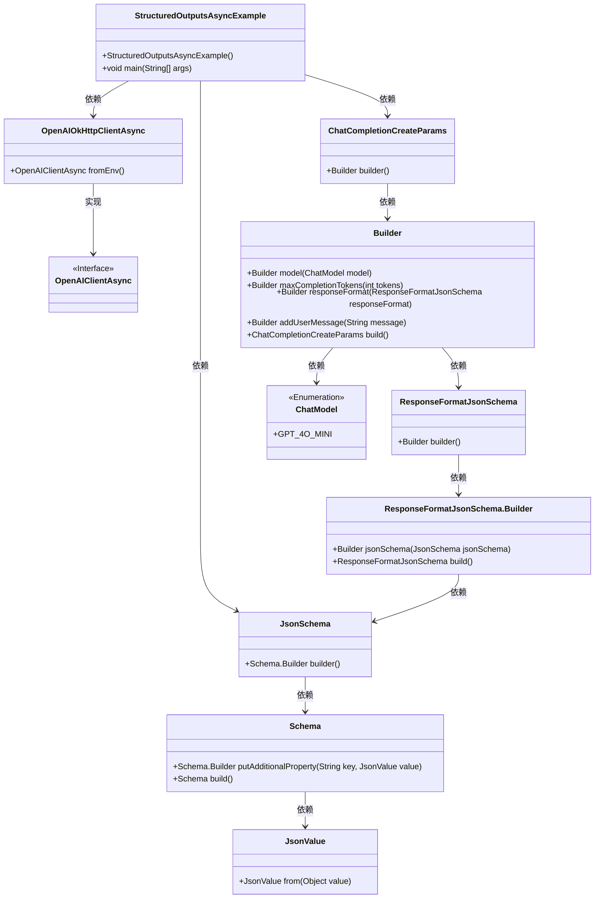
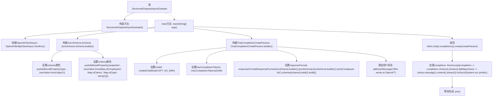

# 基础信息

|      |      |
|------|------|
| 名称 | StructuredOutputsAsyncExample |
| 编码语言 | .java |
| 代码路径 | openai-java/openai-java-example/src/main/java/com/openai/example/StructuredOutputsAsyncExample.java |
| 包名 | com.openai.example |
| 依赖项 | ['com.openai.client.OpenAIClientAsync', 'com.openai.client.okhttp.OpenAIOkHttpClientAsync', 'com.openai.core.JsonValue', 'com.openai.models.ChatModel', 'com.openai.models.ResponseFormatJsonSchema', 'com.openai.models.ResponseFormatJsonSchema.JsonSchema', 'com.openai.models.chat.completions.ChatCompletionCreateParams', 'java.util.Map'] |
| 概述说明 | 配置OpenAI客户端，定义JSON模式，发送异步聊天请求并输出结果。 |

# 说明

Java异步示例展示了如何配置OpenAI客户端，定义JSON模式，发送聊天请求并输出结果。首先，通过配置OpenAI客户端，确保与API的连接和认证。接着，定义JSON模式以结构化请求数据，确保符合API要求。然后，使用异步方式发送聊天请求，以提高效率和响应速度。最后，处理并输出请求结果，确保数据的准确性和完整性。整个过程展示了异步编程在API调用中的应用，提升了系统性能和用户体验。

# 类列表 Class Summary

| 名称   | 类型  | 说明 |
|-------|------|-------------|
| StructuredOutputsAsyncExample | class | Java异步示例：配置OpenAI客户端，定义JSON模式，发送聊天请求并输出结果。 |

## 类 StructuredOutputsAsyncExample

|      |      |
|------|------|
| 访问范围 | public final |
| 类型 | class |
| 名称 | StructuredOutputsAsyncExample |
| 说明 | Java异步示例：配置OpenAI客户端，定义JSON模式，发送聊天请求并输出结果。 |

### UML类图

```mermaid
classDiagram
    class StructuredOutputsAsyncExample {
        +StructuredOutputsAsyncExample()
        +void main(String[] args)
    }

    class OpenAIClientAsync {
        <<Interface>>
    }

    class OpenAIOkHttpClientAsync {
        +OpenAIClientAsync fromEnv()
    }

    class JsonSchema {
        +Schema.Builder builder()
    }

    class Schema {
        +Schema.Builder putAdditionalProperty(String key, JsonValue value)
        +Schema build()
    }

    class JsonValue {
        +JsonValue from(Object value)
    }

    class ChatCompletionCreateParams {
        +Builder builder()
    }

    class Builder {
        +Builder model(ChatModel model)
        +Builder maxCompletionTokens(int tokens)
        +Builder responseFormat(ResponseFormatJsonSchema responseFormat)
        +Builder addUserMessage(String message)
        +ChatCompletionCreateParams build()
    }

    class ChatModel {
        <<Enumeration>>
        +GPT_4O_MINI
    }

    class ResponseFormatJsonSchema {
        +Builder builder()
    }

    class ResponseFormatJsonSchema.Builder {
        +Builder jsonSchema(JsonSchema jsonSchema)
        +ResponseFormatJsonSchema build()
    }

    StructuredOutputsAsyncExample --> OpenAIOkHttpClientAsync : 依赖
    OpenAIOkHttpClientAsync --> OpenAIClientAsync : 实现
    StructuredOutputsAsyncExample --> JsonSchema : 依赖
    StructuredOutputsAsyncExample --> ChatCompletionCreateParams : 依赖
    ChatCompletionCreateParams --> Builder : 依赖
    Builder --> ChatModel : 依赖
    Builder --> ResponseFormatJsonSchema : 依赖
    ResponseFormatJsonSchema --> ResponseFormatJsonSchema.Builder : 依赖
    ResponseFormatJsonSchema.Builder --> JsonSchema : 依赖
    JsonSchema --> Schema : 依赖
    Schema --> JsonValue : 依赖
```

这段代码展示了一个异步调用OpenAI API的示例，主要涉及配置OpenAI客户端、构建JSON Schema、设置聊天完成参数以及处理API响应。`StructuredOutputsAsyncExample`类通过`OpenAIOkHttpClientAsync`获取客户端实例，并使用`JsonSchema`和`ChatCompletionCreateParams`构建请求参数，最终异步处理API响应并输出结果。

### 内部方法调用关系图

```mermaid
graph TD
    A["类StructuredOutputsAsyncExample"]
    B["构造方法: StructuredOutputsAsyncExample()"]
    C["main方法: main(String[] args)"]
    D["创建OpenAIClientAsync: OpenAIOkHttpClientAsync.fromEnv()"]
    E["构建JsonSchema.Schema: JsonSchema.Schema.builder()"]
    F["设置schema属性: putAdditionalProperty('type', JsonValue.from('object'))"]
    G["设置schema属性: putAdditionalProperty('properties', JsonValue.from(Map.of('employees', Map.of('items', Map.of('type', 'string')))))"]
    H["构建ChatCompletionCreateParams: ChatCompletionCreateParams.builder()"]
    I["设置model: model(ChatModel.GPT_4O_MINI)"]
    J["设置maxCompletionTokens: maxCompletionTokens(2048)"]
    K["设置responseFormat: responseFormat(ResponseFormatJsonSchema.builder().jsonSchema(JsonSchema.builder().name('employee-list').schema(schema).build()).build())"]
    L["添加用户消息: addUserMessage('Who works at OpenAI?')"]
    M["调用client.chat().completions().create(createParams)"]
    N["处理completion: thenAccept(completion -> completion.choices().stream().flatMap(choice -> choice.message().content().stream()).forEach(System.out::println))"]
    O["等待完成: join()"]

    A --> B
    A -.-> C
    C --> D
    C --> E
    E --> F
    E --> G
    C --> H
    H --> I
    H --> J
    H --> K
    H --> L
    C --> M
    M --> N
    N --> O
```

这段代码展示了一个异步调用OpenAI API的示例。首先，通过环境变量配置OpenAI客户端，然后构建一个JSON Schema用于定义响应的结构。接着，配置聊天完成参数，包括模型、最大令牌数和响应格式，并添加用户消息。最后，异步调用API并处理返回的完成结果，输出内容到控制台。整个过程展示了如何通过异步方式与OpenAI API进行交互并处理响应。

### 字段列表 Field List

| 名称  | 类型  | 说明 |
|-------|-------|------|

### 方法列表 Method List

| 名称  | 类型  | 说明 |
|-------|-------|------|
| main | void | Java代码配置OpenAI客户端，生成JSON模式，调用GPT-4模型，询问OpenAI员工信息并输出结果。 |

