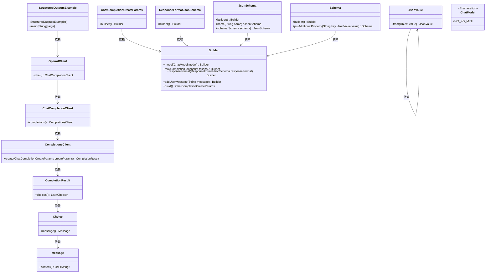
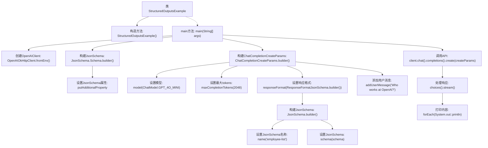

# 基础信息

|      |      |
|------|------|
| 名称 | StructuredOutputsExample |
| 编码语言 | .java |
| 代码路径 | openai-java/openai-java-example/src/main/java/com/openai/example/StructuredOutputsExample.java |
| 包名 | com.openai.example |
| 依赖项 | ['com.openai.client.OpenAIClient', 'com.openai.client.okhttp.OpenAIOkHttpClient', 'com.openai.core.JsonValue', 'com.openai.models.ChatModel', 'com.openai.models.ResponseFormatJsonSchema', 'com.openai.models.ResponseFormatJsonSchema.JsonSchema', 'com.openai.models.chat.completions.ChatCompletionCreateParams', 'java.util.Map'] |
| 概述说明 | Java代码示例：配置OpenAI环境变量，构建JSON，发送聊天请求并输出结果。 |

# 说明

该内容描述了使用Java代码通过OpenAI客户端进行操作的流程。首先，配置环境变量以确保客户端能够正确访问OpenAI服务。接着，构建JSON模式以定义请求的结构和内容。然后，发送聊天请求到OpenAI服务器，并等待响应。最后，输出请求的结果，展示聊天响应的内容。整个过程展示了如何通过Java代码与OpenAI服务进行交互，完成聊天请求并获取结果。

# 类列表 Class Summary

| 名称   | 类型  | 说明 |
|-------|------|-------------|
| StructuredOutputsExample | class | Java代码示例：使用OpenAI客户端配置环境变量，构建JSON模式，发送聊天请求并输出结果。 |

## 类 StructuredOutputsExample

|      |      |
|------|------|
| 访问范围 | public final |
| 类型 | class |
| 名称 | StructuredOutputsExample |
| 说明 | Java代码示例：使用OpenAI客户端配置环境变量，构建JSON模式，发送聊天请求并输出结果。 |

### UML类图

### 描述
这段代码展示了如何使用OpenAI的API进行结构化输出的生成。`StructuredOutputsExample`类通过`OpenAIClient`与OpenAI的API进行交互，配置了JSON Schema来定义输出的结构，并发送用户消息以获取响应。代码中涉及多个类，包括`ChatCompletionCreateParams`用于构建请求参数，`JsonSchema`用于定义JSON结构，`ChatModel`用于指定模型类型。最终，通过`CompletionsClient`发送请求并处理返回的响应。

### 内部方法调用关系图

这段代码展示了如何使用OpenAI的API来生成结构化的输出。首先，代码通过环境变量配置OpenAIClient，然后构建一个JsonSchema来定义响应的格式。接着，代码创建了一个ChatCompletionCreateParams对象，设置了模型、最大tokens、响应格式以及用户消息。最后，代码调用API并处理返回的响应，将内容打印到控制台。

### 字段列表 Field List

| 名称  | 类型  | 说明 |
|-------|-------|------|

### 方法列表 Method List

| 名称  | 类型  | 说明 |
|-------|-------|------|
| main | void | Java代码配置OpenAI客户端，生成JSON模式，发送聊天请求并输出结果。 |

