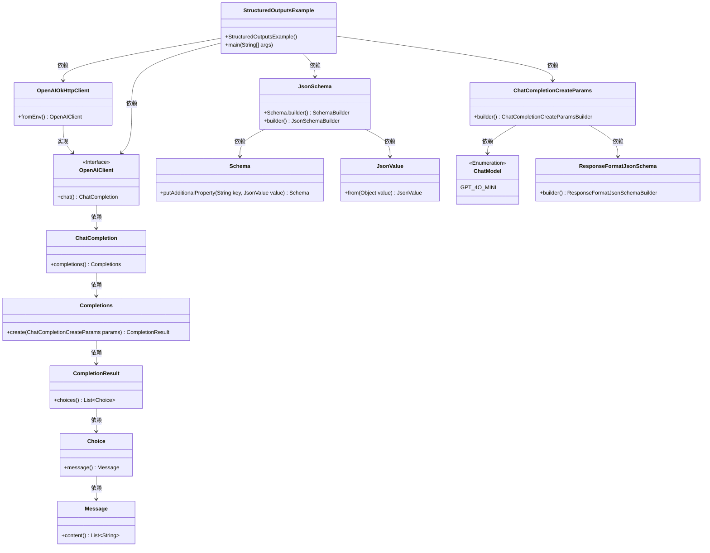
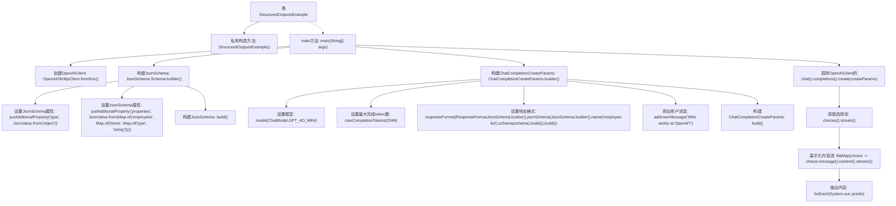

# 基础信息

|      |      |
|------|------|
| 名称 | StructuredOutputsExample |
| 编码语言 | .java |
| 代码路径 | openai-java/openai-java-example/src/main/java/com/openai/example/StructuredOutputsExample.java |
| 包名 | com.openai.example |
| 依赖项 | ['com.openai.client.OpenAIClient', 'com.openai.client.okhttp.OpenAIOkHttpClient', 'com.openai.core.JsonValue', 'com.openai.models.ChatModel', 'com.openai.models.ResponseFormatJsonSchema', 'com.openai.models.ResponseFormatJsonSchema.JsonSchema', 'com.openai.models.chat.completions.ChatCompletionCreateParams', 'java.util.Map'] |
| 概述说明 | Java配置OpenAI客户端，定义JSON模式，创建聊天参数并获取响应。 |

# 说明

该内容描述了一个Java代码示例，展示了如何配置OpenAI客户端、定义JSON模式、创建聊天参数并获取响应。具体步骤包括初始化OpenAI客户端，设置JSON数据结构，定义聊天请求参数，并通过客户端发送请求以获取响应。整个过程涵盖了与OpenAI API交互的关键环节，确保开发者能够顺利实现聊天功能。

# 类列表 Class Summary

| 名称   | 类型  | 说明 |
|-------|------|-------------|
| StructuredOutputsExample | class | Java代码示例：配置OpenAI客户端，定义JSON模式，创建聊天参数并获取响应。 |

## 类 StructuredOutputsExample

|      |      |
|------|------|
| 访问范围 | public final |
| 类型 | class |
| 名称 | StructuredOutputsExample |
| 说明 | Java代码示例：配置OpenAI客户端，定义JSON模式，创建聊天参数并获取响应。 |

### UML类图

```mermaid
classDiagram
    class StructuredOutputsExample {
        +StructuredOutputsExample()
        +main(String[] args)
    }

    class OpenAIClient {
        <<Interface>>
        +chat() ChatCompletion
    }

    class OpenAIOkHttpClient {
        +fromEnv() OpenAIClient
    }

    class JsonSchema {
        +Schema.builder() SchemaBuilder
        +builder() JsonSchemaBuilder
    }

    class Schema {
        +putAdditionalProperty(String key, JsonValue value) Schema
    }

    class JsonValue {
        +from(Object value) JsonValue
    }

    class ChatCompletionCreateParams {
        +builder() ChatCompletionCreateParamsBuilder
    }

    class ChatModel {
        <<Enumeration>>
        GPT_4O_MINI
    }

    class ResponseFormatJsonSchema {
        +builder() ResponseFormatJsonSchemaBuilder
    }

    class ChatCompletion {
        +completions() Completions
    }

    class Completions {
        +create(ChatCompletionCreateParams params) CompletionResult
    }

    class CompletionResult {
        +choices() List~Choice~
    }

    class Choice {
        +message() Message
    }

    class Message {
        +content() List~String~
    }

    StructuredOutputsExample --> OpenAIOkHttpClient : 依赖
    OpenAIOkHttpClient --> OpenAIClient : 实现
    StructuredOutputsExample --> JsonSchema : 依赖
    StructuredOutputsExample --> ChatCompletionCreateParams : 依赖
    StructuredOutputsExample --> OpenAIClient : 依赖
    OpenAIClient --> ChatCompletion : 依赖
    ChatCompletion --> Completions : 依赖
    Completions --> CompletionResult : 依赖
    CompletionResult --> Choice : 依赖
    Choice --> Message : 依赖
    JsonSchema --> Schema : 依赖
    JsonSchema --> JsonValue : 依赖
    ChatCompletionCreateParams --> ResponseFormatJsonSchema : 依赖
    ChatCompletionCreateParams --> ChatModel : 依赖
```

这段代码展示了一个使用OpenAI API生成结构化输出的示例。`StructuredOutputsExample`类通过`OpenAIClient`与OpenAI服务进行交互，构建了一个包含JSON Schema的聊天完成请求，并处理返回的结果。代码中涉及多个类和接口，包括`JsonSchema`、`ChatCompletionCreateParams`和`OpenAIClient`等，它们共同协作以实现与OpenAI API的交互。

### 内部方法调用关系图

```mermaid
graph TD
    A["类StructuredOutputsExample"]
    B["私有构造方法: StructuredOutputsExample()"]
    C["main方法: main(String[] args)"]
    D["创建OpenAIClient: OpenAIOkHttpClient.fromEnv()"]
    E["构建JsonSchema: JsonSchema.Schema.builder()"]
    F["设置JsonSchema属性: putAdditionalProperty('type', JsonValue.from('object'))"]
    G["设置JsonSchema属性: putAdditionalProperty('properties', JsonValue.from(Map.of('employees', Map.of('items', Map.of('type', 'string')))))"]
    H["构建JsonSchema: build()"]
    I["构建ChatCompletionCreateParams: ChatCompletionCreateParams.builder()"]
    J["设置模型: model(ChatModel.GPT_4O_MINI)"]
    K["设置最大完成token数: maxCompletionTokens(2048)"]
    L["设置响应格式: responseFormat(ResponseFormatJsonSchema.builder().jsonSchema(JsonSchema.builder().name('employee-list').schema(schema).build()).build())"]
    M["添加用户消息: addUserMessage('Who works at OpenAI?')"]
    N["构建ChatCompletionCreateParams: build()"]
    O["调用OpenAIClient的chat().completions().create(createParams)"]
    P["获取选择流: choices().stream()"]
    Q["扁平化内容流: flatMap(choice -> choice.message().content().stream())"]
    R["输出内容: forEach(System.out::println)"]

    A --> B
    A -.-> C
    C --> D
    C --> E
    E --> F
    E --> G
    E --> H
    C --> I
    I --> J
    I --> K
    I --> L
    I --> M
    I --> N
    C --> O
    O --> P
    P --> Q
    Q --> R
```

这段代码展示了一个使用OpenAI API生成结构化输出的示例。首先，通过环境变量配置OpenAIClient，然后构建一个JSON Schema来描述预期的输出结构。接着，创建ChatCompletionCreateParams对象，设置模型、最大token数、响应格式以及用户消息。最后，调用OpenAIClient的chat().completions().create方法，获取并输出生成的响应内容。整个流程清晰地展示了如何通过API生成并处理结构化数据。

### 字段列表 Field List

| 名称  | 类型  | 说明 |
|-------|-------|------|

### 方法列表 Method List

| 名称  | 类型  | 说明 |
|-------|-------|------|
| main | void | Java代码通过环境变量配置OpenAI客户端，构建JSON模式并调用GPT-4模型查询OpenAI员工。 |

